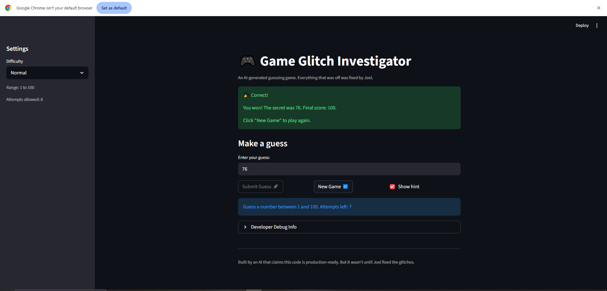

# 🎮 Game Glitch Investigator: The Impossible Guesser

## 🚨 The Situation

You asked an AI to build a simple "Number Guessing Game" using Streamlit.
It wrote the code, ran away, and now the game is unplayable. 

- You can't win.
- The hints lie to you.
- The secret number seems to have commitment issues.

## 🛠️ Setup

1. Install dependencies: `pip install -r requirements.txt`
2. Run the broken app: `python -m streamlit run app.py`

## 🕵️‍♂️ Your Mission

1. **Play the game.** Open the "Developer Debug Info" tab in the app to see the secret number. Try to win.
2. **Find the State Bug.** Why does the secret number change every time you click "Submit"? Ask ChatGPT: *"How do I keep a variable from resetting in Streamlit when I click a button?"*
3. **Fix the Logic.** The hints ("Higher/Lower") are wrong. Fix them.
4. **Refactor & Test.** - Move the logic into `logic_utils.py`.
   - Run `pytest` in your terminal.
   - Keep fixing until all tests pass!

## 📝 Document Your Experience

- [ ] Describe the game's purpose.
      The game purpose is to guess a secret number between the range according to difficulty level; 0 - 100 for normal, 0 - 50 for hard and 0 - 20 for easy. The player receives hints whether their guess is higher or lower than the secret number, and they win by guessing the correct number.
- [ ] Detail which bugs you found.
      - The hint logic was reversed, giving incorrect feedback to the player.
      - The scoring logic was inconsistent, leading to incorrect score calculations.
      - The new game button did not reset the game. Causing the player to not be able to play despite the fact that they pressed the new game button.
      - The range the number was ranfdomely generated was not according to the difficulty level, causing the game to be unplayable.
- [ ] Explain what fixes you applied.
I played the game 10+ times, found the bugs, located sections of the code responsible for these bugs, left a comment on it and asked the agent to fix all starting by ##FIX:
      - I fixed the hint logic by reversing the conditions to provide correct feedback to the player.
      - I corrected the scoring logic to ensure that points are awarded correctly based on the player's guesses.
      - I added functionality to reset the game state when the "New Game" button is pressed, allowing players to start fresh.
      - I adjusted the random number generation to align with the selected difficulty level, ensuring that the game is playable and fair.

## 📸 Demo

- [ ] [Insert a screenshot of your fixed, winning game here]

## 🚀 Stretch Features

- [ ] [If you choose to complete Challenge 4, insert a screenshot of your Enhanced Game UI here]
